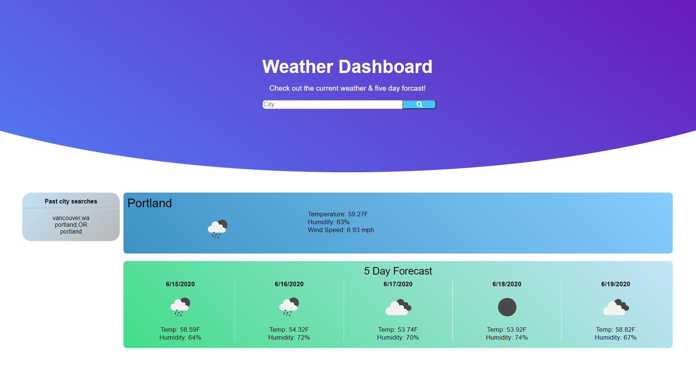

# Weather Dashboard
Need a quick method to check out the weather? Look no further. Just let the site know what city your in and it'll bring up the stats; from humidity, temperature, UV index, and wind speed (hopefully your umbrella won't turn inside out!). Did I mention it'll pull up the 5 day forecast as well? 

Click on any of the past city searches and it will bring up the same info but for the current date! 

## Deployment
Live page at: [https://beki-g.github.io/weatherDashboard/](https://beki-g.github.io/weatherDashboard/)

> Screenshot of deployed dashboard 

## Built with:
* JQuery
* Javascript
* OpenWeather API

## Author
Myself, [Beki](https://github.com/Beki-G)